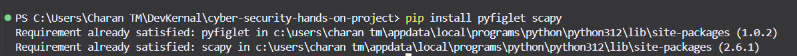
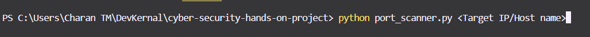

# Port Scanner

## Overview:

Port Scanner is a Python-based tool designed for performing network port scanning efficiently and effectively. It offers three methods of port scanning, tailored to different needs, along with an operating system detection feature based on TTL (Time-To-Live) values.
This tool is ideal for beginners and cybersecurity enthusiasts looking to learn or perform port scanning in a controlled environment.

## Features:

1. Open Port Scan (Slow)
   Scans the first 1024 ports, displaying only the open ones.
   This method is slower as it sequentially scans all ports in the range.

2. Range Port Scan (Recommended)
   Allows users to define a range of ports for scanning, optimizing scanning time.
   Ideal for targeted scans.

3. Quick Port Scan (Fast)
   Uses multithreading to scan ports simultaneously, significantly reducing scan time.
   Each port is scanned in a separate thread for parallel execution.

4. Operating System Detection
   Identifies the target's operating system (Linux-based, Windows-based, or Unknown) using TTL values from response packets.

## How It Works:

1. Port Scanning:
> The tool uses TCP connections to identify open ports on the target machine.
2. OS Detection:
>> The TTL value from the response packet is analyzed:
> TTL ≤ 64: Likely Linux-based OS.
> TTL > 64 and ≤ 128: Likely Windows-based OS.
> TTL > 128: Unknown or other OS.

## Requirements:

1. Python 3.7+
2. Libraries:
>pyfiglet
>socket
>time
>threading
>scapy
   

## Run the script with the following command:

## Options:

After launching the script, choose one of the following scanning options:

1. Open Port Scan

> Scans all 1024 common ports for open ports.
> Output: Displays and logs open ports with their associated services.

2. Range Port Scan

> Prompts for a start and end port.
> Scans only within the specified range, reducing scan time.

3. Quick Port Scan

> Prompts for a start and end port.
> Performs multithreaded scanning for rapid results.

4. OS Detection
> The tool automatically detects the target's OS and displays the result.
